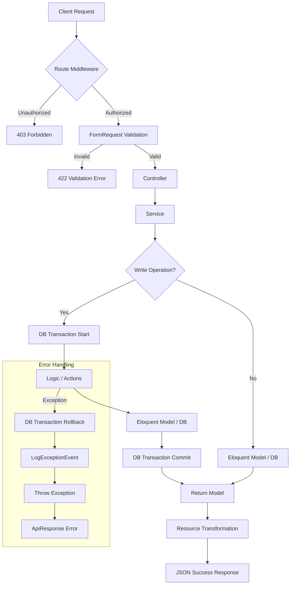

# Salem Backend — Technical Structure & Development Standards

> **FOR AI ASSISTANT:** This document is MANDATORY. Follow every rule here without exception on every task, every file, every line of code. No deviations allowed without explicit user approval.

---

## 1. Critical Non-Negotiables

| Rule               | Requirement                                                                                |
| :----------------- | :----------------------------------------------------------------------------------------- |
| **Architecture**   | Route → Controller → Request → Service → Action → Model → Resource                         |
| **Logic Location** | **ONLY in Services.** Controllers must remain "skinny".                                    |
| **Data Integrity** | Use `DB::beginTransaction()` / `DB::commit()` / `DB::rollBack()` for all write operations. |
| **Error Handling** | Always `try-catch` in Services. Fire `event(new LogExceptionEvent($e))` and re-throw.      |
| **Spacing**        | **MANDATORY**: Empty line before `return` and before `throw`.                              |
| **PHP Docs**       | **STRICT**: Empty line between `@param`, `@return`, and `@throws`.                         |
| **API Responses**  | ONLY via `ApiResponse` trait (`jsonSuccess`, `jsonError`).                                 |
| **Validation**     | ALWAYS use `FormRequest` classes with `$request->validated()` in controllers.              |
| **Migrations**     | **NEVER update existing migrations.** Ask user for edit or only if not committed/pushed.   |
| **Table Defaults** | Every new table **MUST** have `$table->timestamps()` and `$table->softDeletes()`.          |
| **Foreign Keys**   | ONLY use `$table->foreignIdFor(Model::class)`.                                             |
| **Translations**   | Use `__('message')`. Fields must end in `_ar` and `_en`.                                   |
| **Permissions**    | Use `->middleware('permission:Permission Name')` on every protected endpoint.              |
| **Actions**        | Reserved for **Global Static Helpers** (File uploads, guessing types, etc.).               |
| **Attachments**    | Use polymorphic `Attachment` model and `AttachmentResource`.                               |
| **Type Hinting**   | All methods MUST have parameter and return type hints.                                     |

---

## 2. Naming Conventions

To ensure consistency across the codebase, follow these strict naming rules:

| Element           | Convention                          | Example                                |
| :---------------- | :---------------------------------- | :------------------------------------- |
| **Classes**       | PascalCase                          | `BlogService`, `AddBlogRequest`        |
| **Methods**       | camelCase                           | `storeBlog()`, `updateStatus()`        |
| **Variables**     | camelCase                           | `$blogData`, `$isUpdated`              |
| **DB Tables**     | snake_case (plural)                 | `blog_attachments`, `product_variants` |
| **Pivot Tables**  | snake_case (alphabetical, singular) | `attribute_product`, `role_user`       |
| **DB Columns**    | snake_case                          | `created_at`, `title_ar`, `user_id`    |
| **Foreign Keys**  | `model_name_id`                     | `category_id`, `parent_id`             |
| **Enums (Class)** | PascalCase                          | `BlogTypesEnum`                        |
| **Enums (Cases)** | UPPER_SNAKE_CASE                    | `case TEXT_ONE = 'text_one';`          |
| **Routes**        | kebab-case / simple                 | `api/v1/blog-posts`, `/add`, `/edit`   |
| **Files**         | PascalCase (match class)            | `BlogController.php`                   |

---

## 3. Role-Based Partitioning (Admin, Api, Seller)

To maintain a clean separation of concerns, the application is partitioned into role-based directories across the **Controller**, **Request**, and **Resource** layers.

### 3.1. Partitioning Overview

- **Admin**: Contains logic and requests for the administration panel (high-privilege operations).
- **Api (User)**: Contains logic and requests for the end-user/client applications.
- **Seller**: Contains logic for specialized seller roles (if applicable to the project).

> **Note**: For every new project, **Admin** and **Api** are the default mandatory partitions. **Seller** is added only when specifically required.

### 3.2. Directory Mapping

| Layer           | Directory Path                 | Purpose                               |
| :-------------- | :----------------------------- | :------------------------------------ |
| **Controllers** | `app/Http/Controllers/{Role}/` | Entry points for specific roles.      |
| **Requests**    | `app/Http/Requests/{Role}/`    | Role-specific validation rules.       |
| **Resources**   | `app/Http/Resources/{Role}/`   | Role-specific response formatting.    |
| **Services**    | `app/Services/{Feature}/`      | Shared business logic (Domain-based). |

---

## 4. PHP Doc Standards

### 4.1. Method Documentation Rule

Every method MUST have a DocBlock. You MUST include an empty line between different types of tags (`@param`, `@return`, `@throws`).

#### ❌ REJECTED (Incorrect Spacing)

```php
/**
 * Store new product
 *
 * @param array $data
 * @return Product
 * @throws Exception
 */
```

#### ✅ ALLOWED (Correct Spacing)

```php
/**
 * Store new product
 *
 * @param array $data
 *
 * @return Product
 *
 * @throws Exception
 */
```

---

## 5. Feature Architecture Flow



---

## 6. Feature & Sub-Feature Organization

- **Feature Plans**: For every feature, write a plan file in the root (`/plans/feature.md`) and in the implementations folder (`/implementations/feature.md`).
- **Sub-Features**: If a sub-feature is large (e.g., a "Release Milestone"), create a dedicated **Controller** and **Service** for it, but share the same **Route** file for that feature group.
- **Config Usage**: Use `config('file.key')` to access configuration values. Define custom configs in `config/` if necessary.

---

## 7. Roles & Permissions

### 7.1. Role Groups

Roles are typically applied at the routing group level in `RouteServiceProvider` or main route files:

- **Administrator**: `middleware('administrator')`
- **Seller**: `middleware('role:seller')`

### 7.2. Permissions per Endpoint

Every specific action (store, update, delete, show) MUST be protected by a specific permission middleware:

```php
Route::post('/add', [BlogController::class, 'store'])->middleware('permission:Add Blogs');
Route::post('/edit', [BlogController::class, 'update'])->middleware('permission:Edit Blogs');
```

Permission names should follow the pattern: `Action FeatureName` (e.g., `Delete Products`).

---

## 8. Layer Standards & Examples

### 8.1. Database & Migrations

Every migration must include timestamps and soft deletes.

```php
/**
 * Migration for Products table
 */
return new class extends Migration {
    public function up(): void
    {
        Schema::create('products', function (Blueprint $table) {
            $table->id();
            $table->uuid('uuid')->unique();
            $table->string('name_ar');
            $table->string('name_en');
            $table->foreignIdFor(Category::class)->constrained();
            $table->timestamps();
            $table->softDeletes();
        });
    }
};
```

### 8.2. Models (Standard & Localization)

```php
/**
 * A class defined Product model
 */
class Product extends Model
{
    use HasFactory, HasUuid, SoftDeletes;

    protected $guarded = ['id'];
    protected $casts = ['active' => 'boolean'];

    /**
     * Get the name attribute based on the current locale
     *
     * @return string
     */
    public function name(): string
    {
        $lang = app()->getLocale();

        return $this->attributes['name_' . $lang] ?? "";
    }

    /**
     * Relation with Category
     *
     * @return BelongsTo
     */
    public function category(): BelongsTo
    {
        return $this->belongsTo(Category::class);
    }

    /**
     * Boot logic for cascading deletes
     */
    protected static function boot()
    {
        parent::boot();
        static::deleting(function ($model) {
            $model->variants()->delete(); // Cascading soft delete
        });
    }
}
```

### 8.3. Form Requests

```php
/**
 * A class defines the add product request
 */
class AddProductRequest extends FormRequest
{
    public function authorize(): bool { return auth()->check(); }

    /**
     * Get validation rules
     *
     * @return array
     */
    public function rules(): array
    {
        return [
            'name_ar' => ['required', 'string', 'max:255'],
            'name_en' => ['required', 'string', 'max:255'],
            'category_id' => ['required', 'exists:categories,id'],
        ];
    }
}
```

### 8.4. Services (Standard & Advanced Search)

```php
/**
 * A class defines the product service
 */
class ProductService
{
    /**
     * Index products with filters and eager loading
     *
     * @param array $filters
     * @param int $limit
     *
     * @return LengthAwarePaginator
     */
    public function index(array $filters, int $limit): LengthAwarePaginator
    {
        return Product::query()
            ->with(['category']) // Mandatory eager loading
            ->when($filters['search'] ?? null, fn($q, $s) => $q->where('name_en', 'like', "%$s%"))
            ->paginate($limit);
    }

    /**
     * Store new product
     *
     * @param array $data
     *
     * @return Product
     *
     * @throws Exception
     */
    public function store(array $data): Product
    {
        DB::beginTransaction();
        try {
            $product = Product::create([
                'name_ar' => $data['name_ar'],
                'name_en' => $data['name_en'],
                'category_id' => $data['category_id'],
            ]);

            DB::commit();

            return $product;

        } catch (Exception $exception) {
            DB::rollBack();
            event(new LogExceptionEvent($exception));

            throw $exception;
        }
    }

    /**
     * Update product
     *
     * @param Product $product
     * @param array $data
     *
     * @return Product
     *
     * @throws Exception
     */
    public function update(Product $product, array $data): Product
    {
        DB::beginTransaction();
        try {
            $product->update([
                'name_ar' => $data['name_ar'] ?? $product->name_ar,
                'name_en' => $data['name_en'] ?? $product->name_en,
                'category_id' => $data['category_id'] ?? $product->category_id,
            ]);

            DB::commit();

            return $product;

        } catch (Exception $exception) {
            DB::rollBack();
            event(new LogExceptionEvent($exception));

            throw $exception;
        }
    }
}
```

### 8.5. Controllers

Always use `$request->validated()` and constructor injection.

```php
/**
 * A class defines the product controller
 */
class ProductController extends BaseAdminController
{
    public function __construct(protected ProductService $service) {}

    /**
     * Store new product
     *
     * @param AddProductRequest $request
     *
     * @return JsonResponse
     *
     * @throws Exception
     */
    public function store(AddProductRequest $request): JsonResponse
    {
        $product = $this->service->store($request->validated());

        return $this->jsonSuccess(ProductResource::make($product), __('Product created successfully.'));
    }
}
```

---

## 9. How-To Guides

### 9.1. How to Create a New Feature

1.  **Plan**: Write the implementation plan (using the schema in Section 12) in `/plans/feature.md` and `/implementations/feature.md`.
2.  **Migration**: Create table with `timestamps()`, `softDeletes()`, and `foreignIdFor()`.
3.  **Model**: Add `HasUuid`, `SoftDeletes`, and define relations.
4.  **Request**: Create `AddFeatureRequest` and `UpdateFeatureRequest` in the correct role folder (e.g., `Requests/Admin/`).
5.  **Service**: Create `{Feature}Service` with `store`, `update`, `index`, `show`, `delete`.
6.  **Controller**: Create `{Feature}Controller` in the correct role folder (e.g., `Controllers/Admin/`).
7.  **Resource**: Create `{Feature}Resource` in the correct role folder.
8.  **Routes**: Add to `routes/Api/{Role}/` and include in `api.php` or `admin.php`. **Apply permission middleware per endpoint.**

### 9.2. How to Edit a Feature

1.  **Update Plan**: Modify the implementation plan first.
2.  **Request**: Add new fields to the `FormRequest`.
3.  **Service**: Update the logic in the Service. Use `??` to handle optional updates.
4.  **Resource**: Add new fields to the Resource.
5.  **Migration**: If database changes are needed, **create a new migration** (don't edit old ones).

### 9.3. How to Create a New Function

1.  **Locate Layer**: Identify if it's a global action or service-specific logic.
2.  **PHP Doc**: Write the full doc block before writing code. **Strict spacing required.**
3.  **Logic**: Implement with `try-catch` if it's a write operation.
4.  **Spacing**: Add an empty line before `return` or `throw`.

### 9.4. How to Edit a Function

1.  **Analyze Impact**: Check where this function is called.
2.  **Update PHP Doc**: If parameters or return types change.
3.  **Maintain Standards**: Ensure `??` is used for nullable variables and spacing is preserved.
4.  **Test**: Ensure no regressions in existing flows.

---

## 10. Multi-Language & Translations

- **Database**: `title_ar` / `title_en`.
- **Logic**: Use `__('Translation Key')`.
- **Files**: Ensure all keys are added to `lang/ar.json`.
- **Validation**: Translate request validation error responses in the corresponding lang files.

---

## 11. Attachments System

- **Usage**: Use `StoreAttachmentAction` in Services.
- **Resource**: Wrap output in `AttachmentResource`.
- **Logic**: Use polymorphic relations via the `Attachment` model.

```php
if (isset($data['attachments'])) {
    foreach ($data['attachments'] as $attachment) {
        StoreAttachmentAction::store($model, $attachment, 'attachments');
    }
}
```

---

## 12. Implementation Plan Schema (Best Practice)

For every new feature, you MUST create a markdown file following this exact schema. This ensures all layers are considered before coding begins.

### 12.1. Feature Overview

- **Name**: [Feature Name]
- **Goal**: [Briefly describe what this feature achieves]
- **Role Group**: [Admin / Api / Seller]

### 12.2. Database Design

- **Table Name**: `feature_plural_name`
- **New Columns**:
    - `column_name` (type, nullable, default)
- **Relationships**:
    - `belongsTo(Model::class)`
- **Standard Fields**: `id`, `uuid`, `timestamps`, `softDeletes`.

### 12.3. Core Components List

- [ ] **Enum**: `FeatureStatusEnum` (if needed)
- [ ] **Model**: `Feature` (with Uuid, SoftDeletes)
- [ ] **Request**: `AddFeatureRequest`, `UpdateFeatureRequest`
- [ ] **Service**: `FeatureService`
- [ ] **Controller**: `FeatureController`
- [ ] **Resource**: `FeatureResource`

### 12.4. Route & Permissions

- **Route Prefix**: `/v1/feature-name`
- **Endpoints**:
    - `GET /` -> `Index Feature`
    - `POST /add` -> `Add Feature`
    - `GET /{uuid}` -> `Details Feature`
    - `POST /{uuid}/edit` -> `Edit Feature`
    - `DELETE /{uuid}/delete` -> `Delete Feature`

### 12.5. Localization

- [ ] Add `feature_created_success` to `lang/ar.json`
- [ ] Add translatable fields (`name_ar`, `name_en`) to model and request.

### 12.6. Implementation Checklist (Full Detail)

1. [ ] **Migration**: Create table with `uuid`, `timestamps`, `softDeletes`, and `foreignIdFor`. Ensure indexes are added for search columns.
2. [ ] **Model**: Implement `HasUuid`, `SoftDeletes` traits. Define all relationships and fillable fields. Add localization helper methods (`name()`).
3. [ ] **Requests**: Create `Add` and `Update` requests. Implement strict validation rules and translatable error messages.
4. [ ] **Service**: Implement core logic inside a `DB::transaction`. Include `try-catch` blocks and fire `LogExceptionEvent` on failure.
5. [ ] **Controller**: Implement entry points using constructor injection. Return results via the `ApiResponse` trait and appropriate `Resource`.
6. [ ] **Resource**: Format the output to match the frontend requirements. Ensure polymorphic relations (like Attachments) are wrapped in their own resources.
7. [ ] **Routes**: Register role-specific routes. Apply `permission` middleware to every endpoint.
8. [ ] **Testing**: Verify status codes (200, 422, 403), JSON structure, and database persistence. Check localization and transaction rollbacks.

---

## 13. Completion Criteria (Definition of Done — Full Detail)

A feature is only considered **COMPLETE** when it satisfies the following strict technical criteria:

1. **Architecture Integrity**: The implementation strictly follows the `Route → Controller → Request → Service → Action → Model → Resource` pattern.
2. **Logic Isolation**: 100% of the business logic resides in the Service layer. Controllers are purely for request routing and response returning.
3. **Transactional Safety**: Every write operation is wrapped in a `DB::beginTransaction()` / `DB::commit()` block. Failure triggers a `rollBack()` and a logged event.
4. **Security & Permissions**: No endpoint is left unprotected. Every route has a specific `permission` middleware attached.
5. **Performance Optimization**: Index methods use pagination and eager loading (`with()`) to prevent N+1 query issues.
6. **Code Documentation**: Every method has a full PHP DocBlock following the strict spacing rules (empty line before `@return`/`@throws`).
7. **Clean Spacing**: Code follows the mandatory spacing rules (empty line before `return` and `throw` statements).
8. **Localization Compliance**: No hardcoded UI strings. All messages use `__()` and have corresponding keys in `lang/ar.json`.
9. **Git Ready**: Code is clean of debug statements (`dd`, `print_r`), commented-out blocks, and follows the naming conventions in Section 2.
10. **Plan Artifacts**: Dedicated plan and implementation markdown files exist in `/plans/` and `/implementations/`.

---

## 14. Development Checkpoints (Full Detail)

| Phase | Checkpoint | Requirement |
| :--- | :--- | :--- |
| **I. Planning** | **Plan Approval** | Implementation Plan markdown file exists, covers all layers, and is approved by the Lead. |
| **II. Database** | **Schema Audit** | Migration uses `uuid`, `timestamps`, `softDeletes`. Indexes added. Seeder/Factory created. |
| **III. Logic** | **Service Review** | Service handles logic, uses transactions, and implements full error handling with logging. |
| **IV. Validation** | **Request Review** | FormRequest contains strict rules, translatable messages, and appropriate authorization. |
| **V. Presentation** | **Response Audit** | Controller uses Resource transformation. JSON output is verified against the API design. |
| **VI. Security** | **Permission Check** | All routes have `permission` middleware. Role-based directory partitioning is followed. |
| **VII. Language** | **Translation Audit** | All new keys added to `ar.json`. Error messages and DB fields follow multi-lang standards. |
| **VIII. Final** | **Definition of Done** | Full feature passes the 10-point Completion Criteria list in Section 13. |
